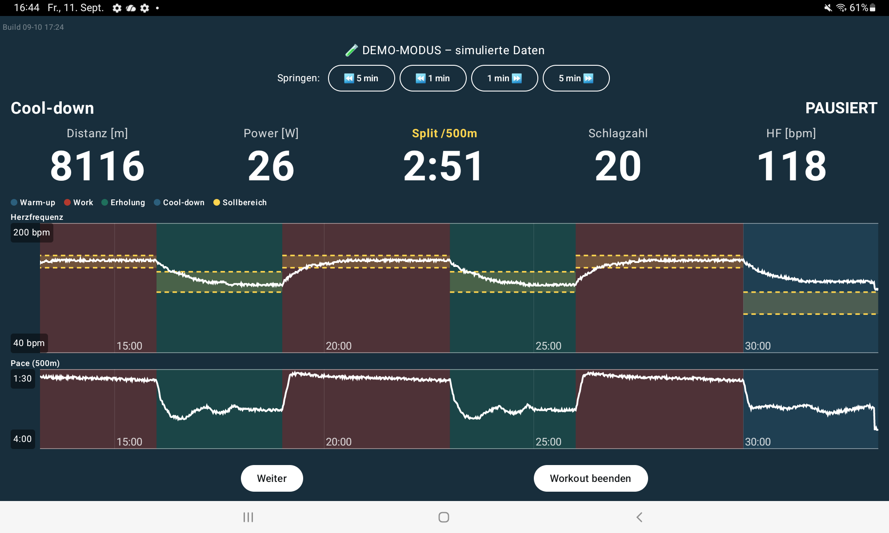

# Nordic4x4 Rower (N44R)

Android-App (Kotlin, Jetpack Compose) für strukturiertes Intervalltraining am Rudergerät,
mit Fokus auf das Norwegian/Nordic-4x4-Intervallprotokoll (4x 4 Minuten Belastung, 3 Minuten
aktive Erholung) – aber genauso für frei konfigurierbares Zeit-, Distanz- und
Intervalltraining mit eigenen Sollbereichen (Pace oder Herzfrequenz) nutzbar.

Verbindet sich direkt per Bluetooth LE (FTMS – Fitness Machine Service, offener
Bluetooth-SIG-Standard) mit dem Rudergerät, ganz ohne Cloud oder Herstellersoftware.

*Dashboard im Demo-Modus: Herzfrequenz- und Pace-Verlauf mit Phasenfärbung und Sollbereich.*

## Installation

Fertige, signierte APK zum direkten Installieren (kein Compiler nötig):
**[Neueste Version herunterladen](https://github.com/cyberdyne-multipass/nordic4x4-rower/releases/latest)**

Auf dem Android-Gerät herunterladen und öffnen; falls gefragt, Installation aus unbekannten
Quellen erlauben (normale Android-Warnung bei Apps außerhalb des Play Store).

## Kompatibilität

Entwickelt und getestet mit einem **WaterRower S4 + ComModule**. Da FTMS ein offener,
herstellerunabhängiger Standard ist, sollte die App grundsätzlich mit jedem Rudergerät
funktionieren, das die Fitness-Machine-Rower-Data-Characteristic (0x2AD1) über BLE anbietet –
das wurde bisher aber nur mit dem oben genannten Gerät verifiziert. Rückmeldungen zu anderen
Geräten sind willkommen.

Dieses Projekt steht in keiner Verbindung zu WaterRower Inc. – "WaterRower" ist eine
eingetragene Marke des jeweiligen Rechteinhabers.

## Funktionen

- Zeit-, Distanz- und Intervalltraining (inkl. Nordic-4x4-Preset)
- Frei konfigurierbare Sollbereiche (Pace oder Herzfrequenz) für Belastungs- und
  Erholungsphasen
- Live-Diagramm (Herzfrequenz + Pace) mit Phasenfärbung und Sollbereich-Anzeige
- FIT-Export (eigener, schlanker Encoder) sowie Bild- und Rohdaten-Export
- Demo-Modus zum Testen ohne angeschlossenes Rudergerät

## Lizenz

MIT License, siehe [LICENSE](LICENSE).
